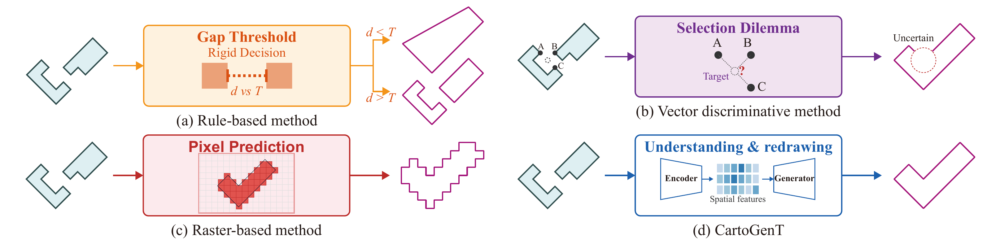

# CartoGenT

English | [简体中文](README_ZH.md)

**CartoGenT: A Generative Multi-scale Transformer Framework for Vector-native Cartographic Building Amalgamation**

This repository is the official resource repository for the CartoGenT paper, providing datasets and online demos.

  

## 📖 Introduction

Building amalgamation is a key operation in cartographic generalization for producing clear and coherent multi-scale maps. CartoGenT is an end-to-end vector-native generative Transformer framework specifically designed for building amalgamation tasks.

### Key Features

- 🎯 **Vector-native Processing**: Operates directly in the vector domain, avoiding precision loss from rasterization
- 🔄 **Multi-scale Architecture**: Uses scale-adaptive module to model cross-scale contextual dependencies
- 🤖 **Generative Modeling**: Jointly predicts vertices and connectivity for topologically valid geometric reconstruction
- 📐 **End-to-end Training**: Complete end-to-end learning from input building groups to output amalgamated results

## 🚀 Online Demo

Experience CartoGenT online:

👉 [https://huggingface.co/spaces/whtower/CartoGenT](https://huggingface.co/spaces/whtower/CartoGenT)

The online demo allows you to:
- Upload custom building data
- View amalgamation results in real-time
- Adjust model parameters
- Download processed results

## 📊 Dataset

The dataset used in this project is publicly available on Figshare:

👉 [https://figshare.com/s/5bdeaee85be6267bd178](https://figshare.com/s/5bdeaee85be6267bd178)

The dataset is constructed based on OpenStreetMap and Ordnance Survey vector building data from Great Britain, including training, validation, and test sets.

## 📄 Paper

The paper is currently under review. More details will be released after publication.
